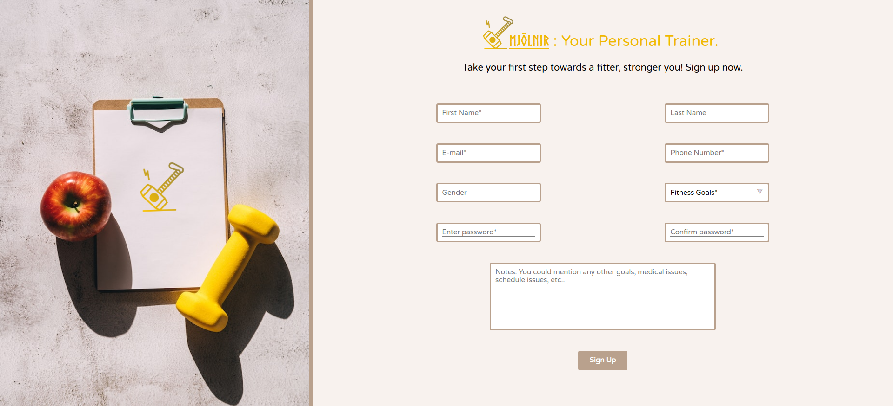
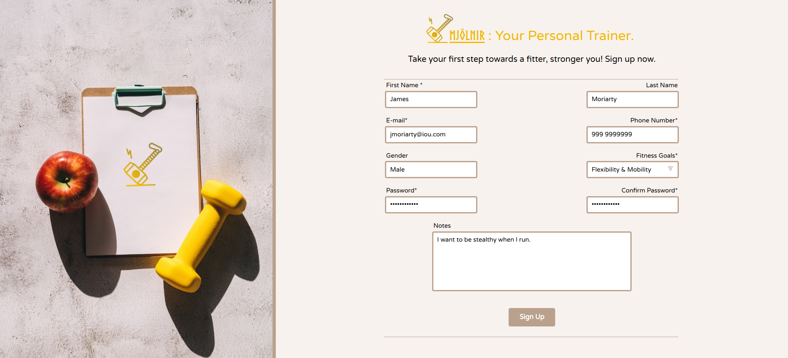

# Fitness Form

This is a simple form for an imaginary fitness program service, built purely from front-end based ingredients.

Forms play a pivotal role in digital services, particularly in the context of websites. They serve as the gateway for services to interact with, and collect and securely store vital and necessary information from clients to provide tailored services to meet their unique needs. This makes forms the core of any customer-centric services.

**Check out my form :point_right:[here](https://mell62.github.io/fitness-form):point_left:!**

